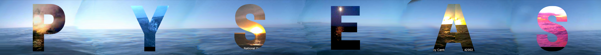

# PySeas





<div align="center">
<h1>

<!-- add temp_2 image -->


<h1 style= "color:blue; font-size: 50px; text-align: center;">
PySeas

</h1>
<p align="center">
  <!-- Typing SVG by DenverCoder1 - https://github.com/DenverCoder1/readme-typing-svg -->
  <a href="https://github.com/DenverCoder1/readme-typing-svg"></a>
</p>

</div>

<div align="center">
<h1>
PySeas Purpose
</h1>
</div>
The world's oceans are an untapped wealth of information that we are only barely beginning to understand. More of the ocean has been untouched by man than any other place on earth.

# Using PySeas as a enVita Artist Agent
Our first application of this project is to create art with the images from these buoys, and use them to generate a tapestry of the beautiful oceans.

Previously, our code was written as shown below, as an outline for a class structure. We will keep the class structure, but we will be using a different approach to the project.

```python
class BuoyImage:
    def __init__(self, location, weather_conditions, image_data):
        self.location = location
        self.weather_conditions = weather_conditions
        self.image_data = image_data

    def get_images(self):
        # Retrieve the images from the NOAA API
        pass

    def stitch_images(self):
        # Stitch the images together
        pass

    def blend_images(self):
        # Blend the images over time
        pass

# Create a GAN to generate images
class GAN:
    def __init__(self, image_data):
        self.image_data = image_data

    def generate_images(self):
        # Generate images using a GAN
        pass

    def blend_images(self):
        # Blend the images over time
        pass

class PanoramicImage:
    def __init__(self, stitched_image_data, horizon_line, time_lapse_data):
        self.stitched_image_data = stitched_image_data
        self.horizon_line = horizon_line
        self.time_lapse_data = time_lapse_data

    def blend_images(self):
        # Blend the images over time
        pass

    def detect_horizon(self):
        # Detect the horizon line
        pass

    def create_time_lapse(self):
        # Create a time-lapse animation
        pass

class Website:
    def __init__(self, layout, content):
        self.layout = layout
        self.content = content

    def generate_html(self):
        # Generate the HTML for the website
        pass

    def generate_css(self):
        # Generate the CSS for the website
        pass

    def generate_javascript(self):
        # Generate the JavaScript for the website
        pass
```

## Phase One: Sunrise over the Sea

Create sunsets over the sea using the images from the NOAA API.


## Phase Two: The Raging of the Storm

Find images of storms and hurricanes, and create a time-lapse of the storm.


# License
PySeas is licensed under the MIT License. See [LICENSE](LICENSE) for more information.

# Contributing
Contributions are welcome! Please see [CONTRIBUTING.md](CONTRIBUTING.md) for more information.

# Acknowledgements


# The Sunset Tapestry

<div align="center">


</div>
